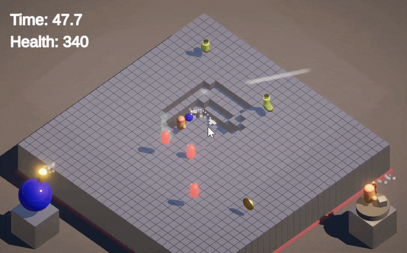

# Rising Ground

A physics-based platformer prototype developed in Unity.

In this game, the ground continuously rises while players must use bombs to destroy terrain, defeat enemies, and survive until the laser clock completes one round.

Demo: [Bilibili Gameplay Video](https://www.bilibili.com/video/BV1458ce7EHh/)

---

## Gameplay

Players navigate an environment where the ground constantly rises over time.  
To survive, they must strategically use bombs to destroy terrain, defeat enemies, and create paths to climb upward.

Explosions also generate physical force that can knock the player away, creating a **risk–reward gameplay loop**. Poor positioning or timing may cause the player to be pushed off platforms.

Players can also collect items that grant special effects and switch between different bomb types depending on the situation.

---

## Controls

### Movement

- **WASD / Arrow Keys** — Move  
- **Space** — Jump  

### Bomb

- **Left Click** — Throw bomb  
- **Right Click** — Switch bomb type  

---

## Bomb Types

- **Standard Bomb**  
  Destroys terrain blocks and generates explosion knockback.

- **Shockwave Bomb**  
  Produces a strong shockwave but does not destroy terrain.

---

## Gameplay Systems

- **Destructible terrain system** based on grid-generated cube blocks  
- **Physics-based explosion mechanics** with player knockback  
- **Trajectory prediction system** that calculates projectile motion and visualizes bomb landing positions  
- **Item pickup system** that grants temporary gameplay effects  
- **Player visibility system** that makes terrain blocks transparent when they obstruct the player's view  
- Dynamic platforming challenge with **continuously rising terrain**

---

## How to Win

- Survive until the laser clock completes one round

- **Easter Egg:**  
  Something unexpected happens after winning the round.

---

## Tech Stack

- Unity
- C#
- Unity Physics / Rigidbody interactions
- Grid-based terrain generation
